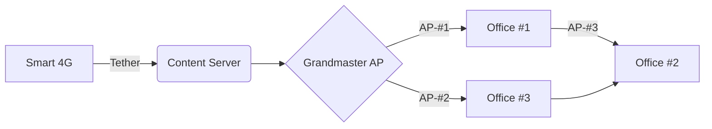

# KOOMPI Fi-Fi Pilot @VitaminAir

## Motivation

The ideas is to utilize 4G internet from telco via smartphone or modem and build a mesh network to share wifi internet in the area such as VitaminAir. If it works well, then many places in the world could also use concept.

In our case, we want to tether internet from a smartphone to a KOOMPI Local Content Server, which act as the Internet receiver, then share it directly to Grandmaster AP (`access point`). 

The GrAP then share internet with other ChildAP. The ChildAP provide WiFi Internet to users.

The graph below explain the mini concept.

## The Site

The distant from GrAP to Office